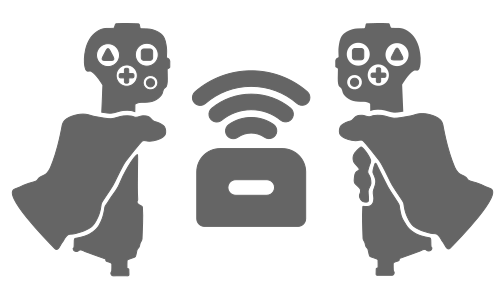

<!--suppress HtmlDeprecatedAttribute -->
<div align="center">
  <h1>ELRS Joystick Control</h1>
</div>
<p align="center">
  
</p>

This application allows you to use one or more joysticks to remote control a drone or airplane.
You can use any device that identifies as a gamepad when connected to a computer over USB.
(e.g. XBox Controller, ThrustMaster Warthog, etc)

<p align="center">
  
</p>

<p align="center">
  <b>THIS APPLICATION IS EXPERIMENTAL (WORK IN PROGRESS)</b>
</p>

## How It Works

The application reads the raw inputs from one or more USB gamepad devices. It takes these
inputs, converts them to Crossfire format (CRSF), and sends them to an RC Transmitter (TX) module.

The TX then sends the control signals over air to the drone.  Both the USB control devices and the
RC Transmitter module must be connected to the same computer where the application is running on.

## How the application talks to the ELRS Transmitter

ELRS TX modules have an I/O pin that is used for receiving radio inputs.

The transmitter module does not really care who is sending data on that pin. It could be an actual device like a
Radio Master TX16S, or it could be this application.

This application uses a serial port to send data to the ELRS TX, and in doing so, pretends to be an RC radio.

## Connecting to the ELRS Transmitter

There are a couple of ways to do this.

### 1) Connecting with an FTDI Adapter


Most computers do not have physical serial ports anymore.
But, you can use a device called an FTDI adapter to emulate a serial port.

On one end, you connect the FTDI adapter to a USB port in your computer. The operating system sees the device
as if it was a virtual serial port.

On the other end, the FTDI adapter has exposed pins for a UART(RX,TX) plus Ground and 5 Volts (VCC) output pins.

To make this work, you must connect the TX pin from the FTDI adapter to the CRSF pin of your ELRS TX module.
You can also power the ELRS TX module using the Ground and 5 Volts output pins.

See diagram below


**Warning**: When you do this, your ELRS TX is in a circuit with your computer's motherboard.
Do not connect any external power source (such as a LiPo Battery) to the ELRS TX.
You can potentially destroy your motherboard if the ELRS TX is not designed properly.

### Configuring the FTDI Adapter

First, download and install the official FTDI VCP (Virtual COM Port) drivers from the [FTDI website](https://ftdichip.com/drivers/)

Then, download and install the [FT Prog](https://ftdichip.com/utilities/#ft_prog) tool from their website as well.

Finally, use the FT Prog tool to re-program the FTDI adapter as follows.

See image below


You have to do this because the ELRS transmitter I/O pin works as an inverted half-duplex UART.

This means:
* **Inverted** - The logical ones and zeros are inverted on the wire. High voltage means 0, low voltage means 1.
* **Half-Duplex UART** - A single pin is used for bidirectional (RX/TX) communication.

So, the FTDI adapter must use the same wire protocol to communicate with the ELRS transmitter.


### 2) Connecting with USB cable

The second and more convenient method is to use a USB cable.

Some ELRS transmitters have a USB port that is used for flashing firmware.
This same USB port can be reconfigured to work as the CRSF I/O pin.

First, download STM32 Virtual COM Port driver, from the [ST Electronics website](https://www.st.com/en/development-tools/stsw-stm32102.html)

Then, access the module's /hardware.html page, and change the CRSF RX/TX pin values.

See image below:


The correct values to use here depend on the module you have.
For example, in my case, with the BetaFPV 1W Micro module, I had to use pins 3 and 1 so that the
ELRS firmware would treat the USB port as if it was the CRSF serial port.

You can usually tell which pin values to use by looking at the ELRS Backpack/Logging configuration
(in the same hardware.html page).

The ELRS Backpack/Logging section is configured by default to use the USB RX/TX pins.
So, copy+paste these values and disable the backpack functionality.

See image below:


Finally, you may need to put your ELRS TX in "Firmware Upgrade" mode for this approach to work.
This is done using the DIP switch on the back of the module. The exact position of the DIP switch varies
from module to module. See the ELRS documentation to determine the proper method for putting the module in "Firmware upgrade" mode.


## How to use the application
When the application starts, it exposes a Web UI on port 3000, and a gRPC service on port 10000.

For most use-cases, the Web UI will give you all the functionality you will need. From there you can do things like
configure the inputs and outputs, setup telemetry widgets, and start/stop the radio control link.

Behind the scenes, the Web-UI uses the gRPC service to interact with the application itself.
You can use the gRPC service directly as well, if you want to interact with the application programmatically.

## How to use the gRPC service

In order to use the gRPC service, you will need a gRPC client. There are a few of those out there like Postman, or [GRPC-UI](https://github.com/fullstorydev/grpcui/releases).

Here is are some instructions for GRPC-UI

1. Download and extract the GRPC-UI binary from their [GitHub releases](https://github.com/fullstorydev/grpcui/releases).
    * Put the `grpcui` binary somewhere in your path
2. Start the **elrs_joystick_control** application (by default it listens on port 10000)
    ```shell
    $ elrs_joystick_control
     gRPC server listenting on port 10000
    ```
3. Start GRPC-UI like this
    ```shell
    $ grpcui -plaintext localhost:10000
     gRPC Web UI available at http://127.0.0.1:53885/
    ```

From GRPC-UI, you can call the methods exposed by the application's gRPC service. The following main methods are available:

* **setConfig** - Receives (and validates) a JSON file containing the full configuration, and stores it in memory
* **getConfig** - Retrieves the full configuration from memory, and sends it as a JSON file

* **startLink** - starts the link with the RF transmitter
* **stopMixer** - stops the link with the RF transmitter

* **startHttp** - Starts the Web-UI HTTP server
* **stopHTTP** - Stops the Web-UI HTTP server

* **getGamepads** - Returns a list of raw input devices connected (joysticks, gamepads, etc)
* **getTransmitters** - Returns a list of available serial ports

There are also a few other data streaming methods available:

* **getEvalStream** - Starts a data stream with the values for all inputs/outputs as they are config is evaluated live
* **getTransmitterStream** - Starts a data stream with the values of all 16 channels as they are received live by the RF transmitter.
* **getGamepadStream** - Starts a data stream with the values of all axes, and buttons as they are output by a gamepad
* **getTelemetryStream** - Starts a data stream with the values of all telemetry frames that are output by the ELRS TX
* **getLinkStream** - Starts a data stream with values for link stats such as count of sent/received frames, and errors.


## Config: Core Concepts

In order to understand the config, you have to grasp two core concepts:

1. Gamepads output values in **RAW** format (for buttons and axes)
    * A **RAW** value is a signed 16-bit integer number, ranging from `-32768` to `32767`.
2. ELRS RF transmitters expect values in **CRSF** format (for RC channels)
    * A **CRSF** value is an unsigned 11-bit integer, ranging from `0` to `1984`.


The conversion between **RAW** and **CRSF** is a uniform linear transformation.
That is, the larger **RAW** range is scaled down to the smaller **CRSF** range.

Your job when building the config, **IS NOT** to tell application how to convert from **RAW** to **CRSF**.
The application itself will do that for you at the very end when the RC channel data is written to the ELRS transmitter.

Your job when building the config, **IS** to tell the application which axes, and which buttons map to which to RC channels.

Having said that, you should still know the basic mappings that happen at the minimum, center, and maximum values.

* **Minimum** - `-32768` **RAW**  maps to `0` **CRSF** (which is also `1000` **PWM**)
* **Center** - `0` **RAW** maps to `992` **CRSF** (which is also `1500` **PWM**)
* **Maximum** - `32768` **RAW** maps to `1984` **CRSF** (which is also `2000` **PWM**)


## Config: File format
The configuration is basically a JSON document that specifies the mapping between gamepads (inputs), and and an RF transmitter (output).
At a high level it looks like this:

```json
{
  "config": {
    "input_output_map": {}
  }
}
```

The **input_output_map** config JSON can get complex very quickly.
You should not build this JSON document manually. Instead, use the Web-UI to create the configuration
as a graph and send it to the application. Behind, the scenes, the Web-UI converts the graph
into the **input_output_map** config JSON.

If you are still curious, you can take a look at the schema for the config over at [schema.yaml](/pkg/config/schema.yaml).
There are a lot of comments in the schema explaining each node in the config does.


## Supported Operating Systems

I have only tested this application in Windows so far, so that's what I can vouch for. But, the code is written such
that it uses cross-platform libraries. So in theory, you should be able to compile it and run it in a Linux machine
as well.

## Compiling on Windows (x86_64)


* Install GoLang SDK
    * Add Go's SDK /bin directory to your path
        * e.g. `C:\Users\your_user\sdk\go1.20.3\bin`
    * Set GOROOT env var (this is where Go SDK is installed)
        * e.g. `GOROOT=C:\Users\your_user\sdk\go1.20.3`
    * Set GOPATH env var (this is where Go's third party packages are installed)
        * e.g. `GOPATH=C:\Users\your_user\go`


* Install Protocol Buffer compiler
    * Download the `win64` zip from the official [releases](https://github.com/protocolbuffers/protobuf/releases/)
    * Extract the zip file somewhere (e.g. `C:\protoc-23.2-win64`)
    * Add the /bin directory to your path
        * e.g. `C:\protoc-23.2-win64\bin`


* Install Protobuf compiler plugins for `go` and `go-grpc`
    * `go install google.golang.org/protobuf/cmd/protoc-gen-go`
    * `go install google.golang.org/grpc/cmd/protoc-gen-go-grpc`


* Install Protobuf compiler plugin for `grpc-web`
    * Download the `windows-x86_64` exe from the official [releases](https://github.com/grpc/grpc-web/releases/)
    * Move the exe file into the protoc /bin directory
        * e.g. `C:\protoc-23.2-win64\bin`


* Install Protobuf compiler plugin for `js`
    * Download the `win64` zip from the official [releases](https://github.com/protocolbuffers/protobuf-javascript/releases)
    * Extract the zip file somewhere (e.g. `C:\protobuf-javascript-3.21.2-win64`)
    * Add the /bin directory to your path
        * e.g. `C:\protobuf-javascript-3.21.2-win64\bin`


* Install mingw
    * Download the `x86_64-*-win32-seh-msvcrt` 7z file from the official [releases](https://github.com/niXman/mingw-builds-binaries/releases)
    * Extract the file somewhere (e.g. `C:\mingw64`)
    * Add the MingGW /bin and /include directories to your path
        * `C:\mingw64\bin`
        * `C:\mingw64\include`


* Install nodejs
    * Download the win64 zip file from the Node.js official [releases](https://nodejs.org/en/download)
    * Extract the zip file somewhere (e.g. `C:\node-v18.16.0-win-x64`)
    * Add `C:\node-v18.16.0-win-x64` to your path  (this dir contains, node.exe, and npm.exe)


* Install SDL2 development libraries
    * Download the `SDL2-devel-*-mingw` zip file from the official [releases](https://github.com/libsdl-org/SDL/releases)
    * Extract the zip somewhere, and find the `x86_64-w64-mingw32` directory
    * Copy the contents of `x86_64-w64-mingw32/bin` into `C:\mingw64\bin`
    * Copy the contents of `x86_64-w64-mingw32/include` into `C:\mingw64\include`


* Run the Go Generate Command from the root of the repo
    * `go generate ./...`


* Run the Go Build Command from the root of the repo
    * `go build -tags static -o elrs_joystick_control.exe cmd\elrs-joystick-control\main.go`


## Compiling on Linux (x86_64)


* Install GoLang SDK
  ```bash
  curl -sflO https://dl.google.com/go/go1.20.5.linux-amd64.tar.gz

  mkdir -p $HOME/go-sdk
  tar -xzvf go1.20.5.linux-amd64.tar.gz -C $HOME/go-sdk

  mkdir -p $HOME/go

  export PATH=$HOME/go-sdk/go/bin:$PATH
  export GOROOT=$HOME/go-sdk/go
  export GOPATH=$HOME/go
  ```

* Install SDL2
  ```bash
  sudo apt-get install libsdl2-2.0-0 libsdl2-dev
  ```

* Run the Go Build Command from the root of the repo
  ```bash
  go build -tags static -o elrs_joystick_control cmd\elrs-joystick-control\main.go
  ``` 
